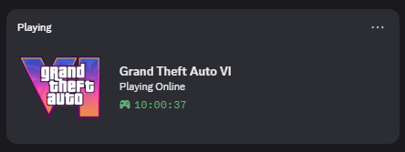

# Discord RPC

### Demo



> **Display any game as your Discord Rich Presence — without installing or purchasing the game.**

A lightweight Discord Rich Presence application that lets you choose a game and display it on your Discord profile.

## Download

**[Download the latest release](https://github.com/bishalqx980/discord_rpc/releases)**

Or build the application yourself using `build_app.cmd`.

> **Requirements:** Python must be installed if you are building the application yourself.

---

## Quick Start

1. Download the latest release from the **[Releases](https://github.com/bishalqx980/discord_rpc/releases)** page.
2. Run `DiscordRPC.exe`.
3. Discord should automatically display the configured game as your Rich Presence.

> (by default it will display GTAVI)

That's it.

---

## Configure Another Game

Want to display a different game?

You can find the **Client ID** of Discord-detectable games using Discord's official Applications List.

### 1. Find the Game

Open:

**https://bishalqx980.github.io/discord_rpc**

Search for the **game name** you want to display.

### 2. Copy the Client ID

Find your game in the results and copy its **Client ID**.

For example:

```text
1440132103672172746
```

### 3. Update `config.json`

Open `config.json` and replace the existing `client_id`:

```json
{
    "client_id": "1440132103672172746",
    "status": "Playing Storymode",
    "play_time": 0
}
```

> Note: play_time is the time is sec, indicates how long you are playing for.

### 4. Restart the Application

Save the file and restart `DiscordRPC.exe`.

Your selected game should now appear in your Discord Rich Presence.

---

## Build From Source

If you prefer to build the application yourself:

```text
build_app.cmd
```

**Requirements:**

* Python 3.x
* Internet connection

The build script will generate the application for you.

---

## Disclaimer

This application **does not install, download, unlock, or provide access to any games**.

It only uses Discord Rich Presence to display a selected game on your Discord profile.

---

<p align="center">
  Made with ❤️ by <a href="https://github.com/bishalqx980">bishalqx980</a>
</p>

---

```text
𝓐 𝓹𝓻𝓸𝓳𝓮𝓬𝓽 𝓸𝓯

 ▄▄▄▄    ██▓  ██████  ██░ ██  ▄▄▄       ██▓
▓█████▄ ▓██▒▒██    ▒ ▓██░ ██▒▒████▄    ▓██▒
▒██▒ ▄██▒██▒░ ▓██▄   ▒██▀▀██░▒██  ▀█▄  ▒██░
▒██░█▀  ░██░  ▒   ██▒░▓█ ░██ ░██▄▄▄▄██ ▒██░
░▓█  ▀█▓░██░▒██████▒▒░▓█▒░██▓ ▓█   ▓██▒░██████▒
░▒▓███▀▒░▓  ▒ ▒▓▒ ▒ ░ ▒ ░░▒░▒ ▒▒   ▓▒█░░ ▒░▓  ░
▒░▒   ░  ▒ ░░ ░▒  ░ ░ ▒ ░▒░ ░  ▒   ▒▒ ░░ ░ ▒  ░
 ░    ░  ▒ ░░  ░  ░   ░  ░░ ░  ░   ▒     ░ ░
 ░       ░        ░   ░  ░  ░      ░  ░    ░  ░
      ░                                       ░
```
